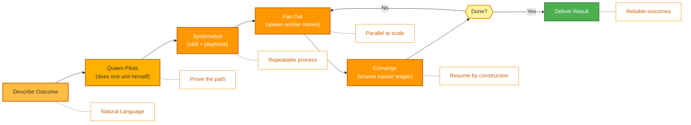

<p align="center">
  
</p>

<p align="center">
  <a href="../../README.md">English</a> |
  <a href="zh-CN.md">简体中文</a> |
  <a href="es.md">Español</a> |
  <a href="hi.md">हिन्दी</a> |
  <a href="pt.md">Português</a> |
  <a href="ja.md">日本語</a> |
  <a href="ru.md">Русский</a> |
  <a href="ko.md">한국어</a>
</p>

<p align="center">
  <a href="https://github.com/aden-hive/hive/blob/main/LICENSE"></a>
  <a href="https://www.ycombinator.com/companies/aden"></a>
  <a href="https://discord.com/invite/MXE49hrKDk"></a>
  <a href="https://x.com/aden_hq"></a>
  <a href="https://www.linkedin.com/company/teamaden/"></a>
  
</p>

<p align="center">
  
  
  
  
  
  
</p>
<p align="center">
  
  
  
</p>

<p align="center"><em>प्रोडक्शन वर्कलोड के लिए एजेंट हार्नेस — स्टेट प्रबंधन, विफलता रिकवरी, ऑब्ज़र्वेबिलिटी और मानवीय निगरानी, ताकि आपके एजेंट वास्तव में चलें।</em></p>

## अवलोकन

OpenHive **एजेंट्स की कॉलोनियों (colonies)** के लिए एक ज़ीरो-सेटअप, मॉडल-एग्नॉस्टिक रनटाइम है। एक कॉलोनी विशेषीकृत एजेंट्स का एक समूह है जो मिलकर एक व्यावसायिक प्रक्रिया चलाते हैं: एक **Queen** (क्वीन) — स्थायी, क्लाइंट-फेसिंग अगुआ — साथ ही उतने **worker** (वर्कर) एजेंट जितने काम को चाहिए। आप परिणाम का वर्णन करते हैं; Queen काम करती है, फिर उसके इर्द-गिर्द एक कॉलोनी विकसित करती है ताकि उस काम को भरोसेमंद रूप से और बड़े पैमाने पर चलाया जा सके।

इसके नीचे का तंत्र है **एक लूप जो कई लूप्स को नियंत्रित करता है**। Hive में एक ही एक्ज़ीक्यूशन प्रिमिटिव है: Queen *स्वयं* एक एजेंट लूप है, और हर worker उसका एक **clone** (क्लोन) है — वही टूल्स, वही मॉडल, अपना अलग कार्य। न कोई ग्राफ़ कंपाइल करना है और न कोई ऑर्केस्ट्रेशन बॉयलरप्लेट लिखनी है। कॉलोनी एक साझा लेजर और एक स्थायी प्लान के माध्यम से समन्वय करती है, जिसमें क्रैश-सेफ स्टेट, गहरी ऑब्ज़र्वेबिलिटी और मानवीय निगरानी उसी एक प्रिमिटिव में निर्मित होती हैं जिसे हर एजेंट साझा करता है। यह कैसे काम करता है, यह जानने के लिए **[Architecture Overview](../architecture/README.md)** देखें।

## विशेषताएँ

- ✅ एजेंट्स की कॉलोनियाँ — एक Queen समानांतर, लंबे समय तक चलने वाले काम के लिए मांग पर worker clones स्पॉन करती है
- ✅ एक प्रिमिटिव, कई लूप्स — कोई ग्राफ़ वायर नहीं करना; Queen रनटाइम पर कॉलोनी को विकसित करती है
- ✅ डेटा बफ़र के बिना समन्वय के लिए साझा tracker लेजर + स्थायी टास्क प्लान
- ✅ CEO-शैली की रूटिंग और विकसित होती, स्कोप्ड मेमोरी के साथ Queen पर्सोना
- ✅ क्रैश-सेफ पार्क/रिज़्यूम, लागत प्रवर्तन, और आउट-ऑफ़-बैंड human-in-the-loop (Sentinel)
- ✅ ज़ीरो सेटअप — किसी तकनीकी कॉन्फ़िगरेशन की आवश्यकता नहीं
- ✅ नेटिव एक्सटेंशन के साथ General Compute Use और Browser Use
- ✅ कस्टम मॉडल सपोर्ट

पूर्ण दस्तावेज़ीकरण, उदाहरणों और मार्गदर्शिकाओं के लिए [adenhq.com](https://adenhq.com) पर जाएँ।

यह देखने के लिए कि AI द्वारा कौन-से जॉब्स ऑटोमेट किए जा रहे हैं, [HoneyComb](http://honeycomb.open-hive.com/) पर जाएँ। यह जॉब्स के लिए एक स्टॉक मार्केट है, जो हमारे समुदाय की AI एजेंट प्रगति से संचालित होता है। आप इस आधार पर जॉब्स को लॉन्ग और शॉर्ट कर सकते हैं (असली पैसे से नहीं बल्कि compute token से) कि आपको कितना लगता है कि किसी जॉब को AI द्वारा प्रतिस्थापित किया जाएगा।

https://github.com/user-attachments/assets/bf10edc3-06ba-48b6-98ba-d069b15fb69d


## Hive किसके लिए है?

Hive उन टीमों के लिए मल्टी-एजेंट हार्नेस लेयर है जो AI एजेंट्स को प्रोटोटाइप से प्रोडक्शन तक ले जा रही हैं। Openclaw और Cowork जैसे सिंगल एजेंट व्यक्तिगत कार्यों को काफ़ी अच्छे से पूरा कर सकते हैं, लेकिन व्यावसायिक प्रक्रियाओं को पूरा करने की कठोरता (rigor) उनमें नहीं होती।

Hive आपके लिए उपयुक्त है यदि आप:

- ऐसे AI एजेंट चाहते हैं जो **वास्तविक व्यावसायिक प्रक्रियाओं को निष्पादित करें**, केवल डेमो नहीं
- ऐसा **रनटाइम चाहते हैं जो स्टेट, रिकवरी और समानांतर निष्पादन को** बड़े पैमाने पर संभाले
- ऐसे **स्वयं-सुधार करने वाले और अनुकूली एजेंट** चाहते हैं जो समय के साथ बेहतर हों
- **human-in-the-loop नियंत्रण**, ऑब्ज़र्वेबिलिटी और लागत सीमाएँ आवश्यक हैं
- एजेंट्स को **प्रोडक्शन** में चलाने की योजना है जहाँ अपटाइम, लागत और ऑडिटेबिलिटी मायने रखते हैं

Hive सर्वोत्तम उपयुक्त नहीं हो सकता यदि आप केवल साधारण एजेंट चेन्स या एकबारगी स्क्रिप्ट्स के साथ प्रयोग कर रहे हैं।

## Hive का उपयोग कब करें?

Hive का उपयोग तब करें जब बाधा (bottleneck) अब मॉडल नहीं बल्कि उसके इर्द-गिर्द का हार्नेस हो:

- लंबे समय तक चलने वाले एजेंट जिन्हें **स्टेट परसिस्टेंस और क्रैश रिकवरी** की आवश्यकता है
- ऐसे प्रोडक्शन वर्कलोड जिन्हें **लागत प्रवर्तन, ऑब्ज़र्वेबिलिटी और ऑडिट ट्रेल्स** की आवश्यकता है
- ऐसे एजेंट जो रिफ्लेक्शन, स्कोप्ड मेमोरी और सीखे गए स्किल्स के माध्यम से **समय के साथ बेहतर होते हैं**
- **साझा tracker लेजर और स्थायी प्लान** के माध्यम से समन्वित समानांतर, मल्टी-एजेंट काम
- ऐसा फ़्रेमवर्क जो मॉडल के सुधारों से लड़ने के बजाय **उनके साथ स्केल करता है**

## त्वरित लिंक

- **[डाक्यूमेंटेशन](https://docs.adenhq.com/)** - पूर्ण गाइड्स और API संदर्भ
- **[सेल्फ-होस्टिंग गाइड](https://docs.adenhq.com/getting-started/quickstart)** - Hive को अपने इंफ़्रास्ट्रक्चर पर डिप्लॉय करें
- **[चेंजलॉग](https://github.com/aden-hive/hive/releases)** - नवीनतम अपडेट और रिलीज़
- **[रोडमैप](../roadmap.md)** - आगामी सुविधाएँ और योजनाएँ
- **[इशू रिपोर्ट करें](https://github.com/aden-hive/hive/issues)** - बग रिपोर्ट और फ़ीचर अनुरोध
- **[योगदान करें](../../CONTRIBUTING.md)** - योगदान करने और PR सबमिट करने का तरीका

## त्वरित शुरुआत

### आवश्यकताएँ

- एजेंट विकास के लिए Python 3.11+
- एक LLM प्रदाता जो एजेंट्स को शक्ति देता है
- **ripgrep (वैकल्पिक, Windows पर अनुशंसित):** `terminal_rg` / `terminal_glob` सर्च टूल्स तेज़ फ़ाइल सर्च के लिए ripgrep का उपयोग करते हैं। यदि इंस्टॉल न हो, तो एक Python फ़ॉलबैक का उपयोग किया जाता है। Windows पर: `winget install BurntSushi.ripgrep` या `scoop install ripgrep`

> **Windows उपयोगकर्ता:** नेटिव Windows को `quickstart.ps1` और `hive.ps1` के माध्यम से सपोर्ट किया जाता है। इन्हें PowerShell 5.1+ में चलाएँ। WSL भी एक विकल्प है लेकिन आवश्यक नहीं।

### इंस्टॉलेशन

> **नोट**
> Hive एक `uv` वर्कस्पेस लेआउट का उपयोग करता है और `pip install` से इंस्टॉल नहीं होता।
> रिपॉज़िटरी रूट से `pip install -e .` चलाने से एक प्लेसहोल्डर पैकेज बनेगा और Hive सही ढंग से काम नहीं करेगा।
> कृपया वातावरण सेट अप करने के लिए नीचे दी गई क्विकस्टार्ट स्क्रिप्ट का उपयोग करें।

```bash
# Clone the repository
git clone https://github.com/aden-hive/hive.git
cd hive

# Run quickstart setup (macOS/Linux)
./quickstart.sh

# Windows (PowerShell)
.\quickstart.ps1
```

यह सेट अप करता है:

- **framework** - मुख्य एजेंट रनटाइम और ग्राफ़ एक्ज़ीक्यूटर (`core/.venv` में)
- **aden_tools** - एजेंट क्षमताओं के लिए MCP टूल्स (`tools/.venv` में)
- **credential store** - एन्क्रिप्टेड API कुंजी भंडारण (`~/.hive/credentials`)
- **LLM provider** - इंटरैक्टिव डिफ़ॉल्ट मॉडल कॉन्फ़िगरेशन, जिसमें Hive LLM और OpenRouter शामिल हैं
- `uv` के साथ सभी आवश्यक Python डिपेंडेंसीज़

- अंत में, यह आपके ब्राउज़र में Hive इंटरफ़ेस खोलेगा

> **टिप:** डैशबोर्ड को बाद में फिर से खोलने के लिए, प्रोजेक्ट डायरेक्टरी से `hive open` चलाएँ।

### अपना पहला एजेंट बनाएँ

होम इनपुट बॉक्स में वह एजेंट टाइप करें जिसे आप बनाना चाहते हैं। Queen आपसे प्रश्न पूछेगी और आपके साथ मिलकर एक समाधान तैयार करेगी।


### टेम्पलेट एजेंट्स का उपयोग करें

"Try a sample agent" पर क्लिक करें और टेम्पलेट्स देखें। आप किसी टेम्पलेट को सीधे चला सकते हैं या मौजूदा टेम्पलेट के ऊपर अपना संस्करण बनाने का विकल्प चुन सकते हैं।

### एजेंट चलाएँ

अब आप किसी एजेंट को चुनकर (मौजूदा एजेंट या उदाहरण एजेंट) चला सकते हैं। आप ऊपर बाईं ओर Run बटन पर क्लिक कर सकते हैं, या Queen एजेंट से बात कर सकते हैं और वह आपके लिए एजेंट चला सकती है।


## इंटीग्रेशन

<a href="https://github.com/aden-hive/hive/tree/main/tools/src/aden_tools/tools"></a>
Hive मॉडल-एग्नॉस्टिक और सिस्टम-एग्नॉस्टिक बनाया गया है।

- **LLM लचीलापन** - Hive Framework, LiteLLM-संगत प्रदाताओं के माध्यम से Anthropic, OpenAI, OpenRouter, Hive LLM और अन्य होस्टेड या लोकल मॉडलों को सपोर्ट करता है।
- **व्यावसायिक सिस्टम कनेक्टिविटी** - Hive Framework को MCP के माध्यम से CRM, सपोर्ट, मैसेजिंग, डेटा, फ़ाइल और आंतरिक APIs जैसे सभी प्रकार के व्यावसायिक सिस्टम से टूल्स के रूप में कनेक्ट करने के लिए डिज़ाइन किया गया है।

## Hive क्यों

जैसे-जैसे मॉडल बेहतर होते हैं, एजेंट क्या कर सकते हैं इसकी ऊपरी सीमा बढ़ती है — लेकिन उनकी विश्वसनीयता और प्रोडक्शन मूल्य हार्नेस द्वारा निर्धारित होते हैं। Hive जेनेरिक एजेंट्स के बजाय वास्तविक व्यावसायिक प्रक्रियाओं को चलाने पर केंद्रित है। आपको एक वर्कफ़्लो ग्राफ़ को हाथ से वायर करने, हर एजेंट इंटरैक्शन को परिभाषित करने और विफलताओं को प्रतिक्रियात्मक रूप से संभालने पर बाध्य करने के बजाय, Hive इस पैरेडाइम को उलट देता है: **आप परिणाम का वर्णन करते हैं, Queen पहले काम करती है, फिर उसे स्केल करने के लिए एक कॉलोनी विकसित करती है** — उपयोग में आसान टूल्स और इंटीग्रेशन्स के सेट के साथ एक परिणाम-उन्मुख, अनुकूली अनुभव।



### यह कैसे काम करता है

1. **[परिणाम का वर्णन करें](../key_concepts/goals_outcome.md)** → सरल भाषा में बताएँ कि आप क्या चाहते हैं; एक CEO-शैली का राउटर सही [Queen](../key_concepts/queen.md) चुनता है
2. **Queen पायलट करती है** → वह स्वयं काम की एक इकाई करती है, रास्ते को सिद्ध करती है और उसे साझा tracker में रिकॉर्ड करती है
3. **[सिस्टमीकरण करें](../key_concepts/improvement.md)** → वह सिद्ध प्रोटोकॉल को एक skill + playbook में बदल देती है — एक दोहराने योग्य प्रक्रिया
4. **[फैन आउट](../key_concepts/colony.md)** → `run_worker` [worker clones](../key_concepts/worker_agent.md) स्पॉन करता है जो समानांतर में चलते हैं और वापस रिपोर्ट करते हैं
5. **अभिसरण और निगरानी** → Workers परिणामों को tracker में लिखते हैं; Queen SQL के माध्यम से सत्यापन करती है, रीयल-टाइम मेट्रिक्स, बजट प्रवर्तन और क्रैश-सेफ रिज़्यूम के साथ

## दस्तावेज़ीकरण

- **[डेवलपर गाइड](../developer-guide.md)** - डेवलपर्स के लिए व्यापक मार्गदर्शिका
- [शुरुआत करें](../getting-started.md) - त्वरित सेटअप निर्देश
- [कॉन्फ़िगरेशन गाइड](../configuration.md) - सभी कॉन्फ़िगरेशन विकल्प
- [आर्किटेक्चर का अवलोकन](../architecture/README.md) - सिस्टम का डिज़ाइन और संरचना

## योगदान करें
हम समुदाय से योगदान का स्वागत करते हैं! हम विशेष रूप से फ़्रेमवर्क के लिए टूल्स, इंटीग्रेशन्स और उदाहरण एजेंट बनाने में मदद की तलाश में हैं ([#2805 देखें](https://github.com/aden-hive/hive/issues/2805))। यदि आप इसकी कार्यक्षमता बढ़ाने में रुचि रखते हैं, तो यह शुरू करने के लिए सबसे अच्छी जगह है। कृपया दिशानिर्देशों के लिए [CONTRIBUTING.md](../../CONTRIBUTING.md) देखें।

**महत्वपूर्ण:** कृपया PR सबमिट करने से पहले किसी issue को अपने नाम असाइन करवाएँ। इसे क्लेम करने के लिए issue पर टिप्पणी करें, और कोई मेंटेनर आपको असाइन कर देगा। पुनरुत्पादन योग्य चरणों और प्रस्तावों वाले issues को प्राथमिकता दी जाती है। इससे डुप्लिकेट काम से बचाव होता है।

1. कोई issue खोजें या बनाएँ और असाइनमेंट प्राप्त करें
2. रिपॉज़िटरी को fork करें
3. अपनी फ़ीचर ब्रांच बनाएँ (`git checkout -b feature/amazing-feature`)
4. अपने बदलावों को commit करें (`git commit -m 'Add amazing feature'`)
5. ब्रांच को push करें (`git push origin feature/amazing-feature`)
6. एक Pull Request खोलें

## समुदाय और सहायता

हम सपोर्ट, फ़ीचर अनुरोधों और कम्युनिटी चर्चाओं के लिए [Discord](https://discord.com/invite/MXE49hrKDk) का उपयोग करते हैं।

- Discord - [हमारे समुदाय से जुड़ें](https://discord.com/invite/MXE49hrKDk)
- Twitter/X - [@adenhq](https://x.com/aden_hq)
- LinkedIn - [कंपनी पेज](https://www.linkedin.com/company/teamaden/)

## हमारी टीम से जुड़ें

**हम भर्ती कर रहे हैं!** इंजीनियरिंग, रिसर्च और गो-टू-मार्केट भूमिकाओं में हमारे साथ जुड़ें।

[खुली पदों को देखें](https://jobs.adenhq.com/a8cec478-cdbc-473c-bbd4-f4b7027ec193/applicant)

## सुरक्षा

सुरक्षा संबंधी चिंताओं के लिए, कृपया [SECURITY.md](../../SECURITY.md) देखें।

## लाइसेंस

यह प्रोजेक्ट Apache License 2.0 के अंतर्गत लाइसेंस्ड है - विवरण के लिए [LICENSE](../../LICENSE) फ़ाइल देखें।

## अक्सर पूछे जाने वाले प्रश्न (FAQ)

**प्रश्न: Hive कौन-कौन से LLM प्रदाताओं को सपोर्ट करता है?**

Hive, LiteLLM इंटीग्रेशन के माध्यम से 100 से अधिक LLM प्रदाताओं को सपोर्ट करता है, जिसमें OpenAI (GPT-4, GPT-4o), Anthropic (Claude मॉडल), Google Gemini, DeepSeek, Mistral, Groq, OpenRouter और Hive LLM शामिल हैं। बस संबंधित API कुंजी एनवायरनमेंट वेरिएबल सेट करें और मॉडल का नाम निर्दिष्ट करें। प्रदाता-विशिष्ट कॉन्फ़िगरेशन उदाहरणों के लिए [docs/configuration.md](../configuration.md) देखें।

**प्रश्न: क्या मैं Hive का उपयोग Ollama जैसे लोकल AI मॉडलों के साथ कर सकता हूँ?**

हाँ! Hive, LiteLLM के माध्यम से लोकल मॉडलों को सपोर्ट करता है। बस `ollama/model-name` फ़ॉर्मेट में मॉडल नाम का उपयोग करें (उदा., `ollama/llama3`, `ollama/mistral`) और सुनिश्चित करें कि Ollama स्थानीय रूप से चल रहा है।

**प्रश्न: Hive को अन्य एजेंट फ़्रेमवर्क्स से अलग क्या बनाता है?**

Hive **एजेंट्स की कॉलोनियाँ** चलाता है, न कि सिंगल एजेंट या हाथ से वायर किए गए एजेंट ग्राफ़। अधिकांश फ़्रेमवर्क आपको अलग-अलग नोड्स और एजेस का ग्राफ़ कंपाइल करने पर बाध्य करते हैं; Hive में एक ही एक्ज़ीक्यूशन प्रिमिटिव है — Queen *स्वयं* एक एजेंट लूप है, और हर worker उसका एक [clone](../key_concepts/the_loop.md) है। ऑर्केस्ट्रेशन एक रनटाइम `run_worker` फैन-आउट है, न कि कंपाइल किया गया DAG, और कॉलोनी एक डेटा बफ़र के बजाय एक [साझा tracker लेजर](../key_concepts/coordination.md) के माध्यम से समन्वय करती है। उस "एक लूप, कई लूप्स" कोर के ऊपर, Hive एक प्रोडक्शन हार्नेस है — क्रैश-सेफ पार्क/रिज़्यूम, लागत प्रवर्तन, रीयल-टाइम ऑब्ज़र्वेबिलिटी और आउट-ऑफ़-बैंड human-in-the-loop — जो हर एजेंट को विरासत में मिलता है क्योंकि केवल एक ही प्रकार का एजेंट है। [Architecture Overview](../architecture/README.md) देखें।

**प्रश्न: क्या Hive ओपन-सोर्स है?**

हाँ, Hive पूरी तरह से Apache License 2.0 के तहत ओपन-सोर्स है। हम समुदाय के योगदान और सहयोग को सक्रिय रूप से प्रोत्साहित करते हैं।

**प्रश्न: क्या Hive human-in-the-loop वर्कफ़्लो को सपोर्ट करता है?**

हाँ। एक Queen **Sentinel** के माध्यम से किसी मानव को आउट-ऑफ़-बैंड एस्केलेट करती है — एक अकाउंट-बाउंड Slack/Telegram चैनल। एजेंट लूप पार्क हो जाता है (अपनी स्टेट को डिस्क पर परसिस्ट करते हुए), मानव को सूचित करता है, और जब वे उत्तर देते हैं तो ठीक वहीं से फिर शुरू हो जाता है जहाँ उसने छोड़ा था। चूँकि एस्केलेशन किसी ग्राफ़ में एक नोड नहीं है, इसलिए किसी कॉलोनी का कोई भी एजेंट किसी भी बिंदु पर मानवीय निर्णय के लिए रुक सकता है, कॉन्फ़िगर करने योग्य टाइमआउट और एस्केलेशन नीतियों के साथ। [Architecture Overview](../architecture/README.md#reliability-is-in-the-primitive) देखें।

**प्रश्न: Hive कौन सी प्रोग्रामिंग भाषाओं को सपोर्ट करता है?**

Hive फ़्रेमवर्क Python में बनाया गया है। एक JavaScript/TypeScript SDK रोडमैप पर है।

**प्रश्न: क्या Hive एजेंट बाहरी टूल्स और APIs के साथ इंटरैक्ट कर सकते हैं?**

हाँ। कॉलोनी के हर एजेंट के पास बिल्ट-इन टूल एक्सेस होता है, और Hive, MCP के माध्यम से बाहरी APIs, डेटाबेस और सेवाओं से कनेक्ट होता है — जिसमें 100 से अधिक इंटीग्रेशन टूल्स के साथ-साथ नेटिव एक्सटेंशन के माध्यम से General Compute Use और Browser Use शामिल हैं। चूँकि Queen और उसके workers एक ही टूल सरफेस साझा करते हैं, इसलिए आपके द्वारा जोड़ी गई कोई भी क्षमता पूरी कॉलोनी के लिए उपलब्ध होती है।

**प्रश्न: Hive में लागत नियंत्रण कैसे काम करता है?**

Hive विस्तृत बजट नियंत्रण प्रदान करता है जिसमें खर्च की सीमाएँ, थ्रॉटल्स और स्वचालित मॉडल डिग्रेडेशन नीतियाँ शामिल हैं। आप टीम, एजेंट या वर्कफ़्लो स्तर पर बजट सेट कर सकते हैं, रीयल-टाइम लागत ट्रैकिंग और अलर्ट के साथ।

**प्रश्न: मुझे उदाहरण और दस्तावेज़ीकरण कहाँ मिलेंगे?**

पूर्ण गाइड्स, API संदर्भ और शुरुआत करने के ट्यूटोरियल्स के लिए [docs.adenhq.com](https://docs.adenhq.com/) पर जाएँ। रिपॉज़िटरी में `docs/` फ़ोल्डर में दस्तावेज़ीकरण और एक व्यापक [डेवलपर गाइड](../developer-guide.md) भी शामिल है।

**प्रश्न: मैं Aden में योगदान कैसे कर सकता हूँ?**

योगदान का स्वागत है! रिपॉज़िटरी को fork करें, अपनी फ़ीचर ब्रांच बनाएँ, अपने बदलाव लागू करें, और एक pull request सबमिट करें। विस्तृत दिशानिर्देशों के लिए [CONTRIBUTING.md](../../CONTRIBUTING.md) देखें।

## स्टार इतिहास

<a href="https://www.star-history.com/?type=date&repos=aden-hive%2Fhive">
 <picture>
   <source media="(prefers-color-scheme: dark)" srcset="https://api.star-history.com/chart?repos=aden-hive/hive&type=date&theme=dark&legend=top-left&sealed_token=vfX1DG8w_KTkonUUtIEjFRLvBopgDzxQpyb8hiYT22sobcDIpvQiMciZghLsDu5hyU3LJs-ZddFjl8eYFx5zRrY-kcMRsfyQ3vAiacsroPoqgRYmZaES3Q" />
   <source media="(prefers-color-scheme: light)" srcset="https://api.star-history.com/chart?repos=aden-hive/hive&type=date&legend=top-left&sealed_token=vfX1DG8w_KTkonUUtIEjFRLvBopgDzxQpyb8hiYT22sobcDIpvQiMciZghLsDu5hyU3LJs-ZddFjl8eYFx5zRrY-kcMRsfyQ3vAiacsroPoqgRYmZaES3Q" />
   
 </picture>
</a>

---

<p align="center">
  सैन फ्रांसिस्को में 🔥 जुनून के साथ बनाया गया
</p>
